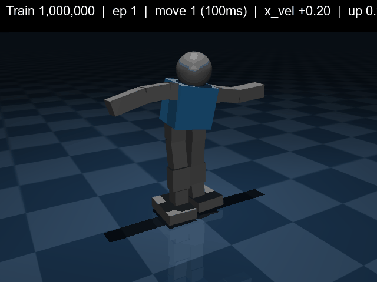

# Alpha Humanoid Walking — SAC

Bipedal locomotion for the **Alpha humanoid robot** (16 DOF, ~1.58 kg) using Soft Actor-Critic in MuJoCo.



## What it does

Trains a policy that walks stably forward at ~0.3 m/s with no falls over 1M+ steps. Each policy step = 100ms, directly mappable to real servo commands (position + transition time).

## Key design choices

- **Action space**: normalised joint positions [-1, 1] centered on neutral pose — `action=0` maps to standing pose
- **Policy step = 100ms**: matches real servo API timing
- **Reward shaping**: forward velocity + foot height (rear leg only) + push-off + yaw/lateral penalties
- **Foot height reward**: forces weight transfer between legs to achieve real walking gait

## Train

```
cd DDPG-SAC-HumanoidWalking
python -u main_sac_alpha1.py
```

Checkpoints saved every 50k steps to `checkpoints/sac_alpha/`. GIFs auto-generated in `media/`.

## Evaluate

```
# Generate MP4 from a checkpoint
python eval/export_mp4.py --ckpt checkpoints/sac_alpha/sac2_checkpoint_1000000.pt --step 1000000

# Generate GIF
python eval/make_checkpoint_gif.py --ckpt checkpoints/sac_alpha/sac2_checkpoint_1000000.pt --step 1000000
```

## Structure

```
DDPG-SAC-HumanoidWalking/
├── main_sac_alpha1.py       # Training loop
├── envs/alpha_env.py        # MuJoCo environment + reward shaping
├── robot/alpha_single.xml   # Robot model (16 actuators, kp=20)
├── eval/
│   ├── export_mp4.py        # Smooth MP4 with joint angle bars
│   └── make_checkpoint_gif.py
└── media/                   # GIFs and videos per training run
```
