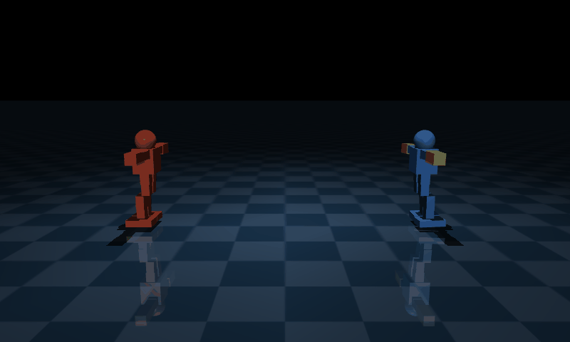

# Alpha Humanoid — andar y combatir con SAC

Dos robots humanoides **UBTech Alpha** (16 DOF, ~1.58 kg) simulados en MuJoCo que
**andan el uno hacia el otro, se paran a distancia de golpeo y pelean con los brazos
hasta que uno cae**. Todas las políticas se entrenan con Soft Actor-Critic (SAC)
propio en PyTorch.



---

## 1. El combate

El asalto completo (`walk_and_fight.py`) **no entrena nada**: encadena dos políticas
ya entrenadas por separado.

| Fase | Duración típica | Quién controla | Qué pasa |
|---|---|---|---|
| **1. Andar** | 1–3 s | Política de **acercamiento** (piernas) | Los robots arrancan separados y andan uno hacia el otro con los brazos en 0, como en su entrenamiento. |
| **2. Cuadrarse** | 0.5 s | Transición fija (no física) | Al llegar a 0.16 m (raíz-raíz) se llevan a la postura de arranque del combate: piernas neutras, tronco recto mirando al rival, brazos en guardia. Se conserva el sitio donde han llegado. |
| **3. Pegar** | hasta KO | Política de **combate** (brazos) | Las piernas quedan sostenidas por el servo PD en postura neutra y los brazos golpean hasta que uno cae. |

**Por qué la fase 2 no es física:** el andar entrenado llega con el tronco inclinado
y las piernas a media zancada. Pasando directamente a combate, ~50% de los robots se
caían solos aunque los brazos estuvieran quietos. Con la transición no hay caídas
pasivas. Si se lleva al robot real, ese tramo habrá que resolverlo de otra forma.

### Ejecutar

```
py -3 walk_and_fight.py            # todas las simulaciones de la lista
py -3 walk_and_fight.py --sim 3    # solo la simulación 3
```

Opciones: `--walk_dir` / `--fight_dir` (carpeta de checkpoints; por defecto la más
reciente), `--max_fight_steps` (300 = 30 s), `--out_dir`.

Salida en `media/YYYY_MM_DD_walk_and_fight/`:
- `simNN_<nombre>_<resultado>_golpesA-B.gif`, un GIF por simulación (10 fps, tiempo real).
- `resumen.csv` con los parámetros y el resultado de cada simulación.

Resultados posibles: `ko_r1` / `ko_r2` (el rival cae tras recibir un golpe),
`r1_cae_solo` / `r2_cae_solo`, `ambos_caidos`, `sin_ko`, `r1_cae_andando` /
`r2_cae_andando`, `no_llegan`.

### Parametrización de las simulaciones

Las simulaciones se definen en la lista `_SIMULACIONES` al principio del script.
Cada una cambia un solo parámetro respecto a la base:

| Parámetro | Significado | Base |
|---|---|---|
| `seed` | Ruido inicial de las articulaciones (±0.05 rad) | 4 |
| `start_dist` | Separación inicial raíz-raíz (m); el acercamiento se entrenó a 2.0 | 1.2 |
| `lateral` | Desfase lateral (m) entre los dos robots | 0 |
| `yaw_r1` / `yaw_r2` | Giro inicial de cada robot (grados) respecto a mirar al rival | 0 / 0 |
| `fight_ckpt` | Step del checkpoint de combate (`None` = el más reciente) | último |

### Limitaciones conocidas

- Aproximadamente 1 de cada 4 asaltos acaba con un robot caído **andando**, antes de
  llegar a pelear. Es la calidad actual de la política de acercamiento.
- El contador de golpes se infla en algunos asaltos (p. ej. 122 golpes en 10 s). Una
  mano con el hombro por debajo de 0.6 rad que toca con velocidad se descarga y se
  recarga en el mismo paso, así que puntúa en cada paso.

---

## 2. Redes neuronales y pesos

### Pesos en uso

| Política | Checkpoint | Entrada | Salida | Entrenada con |
|---|---|---|---|---|
| **Acercamiento** (piernas, r1 y r2) | `checkpoints/2026_09_19_versus_stop_dist/{r1,r2}/ckpt_900000.pt` | 34 | 10 | `fighting.py` + `versus_env.py` |
| **Combate** (brazos, r1 y r2) | `checkpoints/2026_10_02_close_combat_ciclo_golpe/{arm_r1,arm_r2}/ckpt_400000.pt` | 30 | 4 | `close_combat.py` + `close_combat_env.py` |
| Andar en solitario (un robot, solo hacia +X) | `checkpoints/walking/sac2_checkpoint_1050000.pt` | 31 | 10 | `walking.py` + `walking_env.py` |

Cada robot tiene **su propia red**: r1 y r2 no comparten pesos. Cada `.pt` guarda
`actor`, `critic`, `critic_target`, `log_alpha` y los estados de los tres optimizadores,
así que se puede resumir el entrenamiento desde ahí.

### Arquitectura (igual en todas las políticas)

```
Actor (política gaussiana con tanh)
  obs ─► Linear(obs, 256) ─► ReLU ─► Linear(256, 256) ─► ReLU ─┬─► mu       Linear(256, act)
                                                               └─► log_std  Linear(256, act), recortado a [-20, 2]
  acción = tanh(muestra N(mu, std))  ∈ [-1, 1]      (en evaluación: tanh(mu))

Critic doble (Q1, Q2, como en TD3/SAC)
  [obs, acción] ─► Linear(obs+act, 256) ─► ReLU ─► Linear(256, 256) ─► ReLU ─► Linear(256, 1)   (×2)
  + copia objetivo actualizada con promedio suave (tau)
```

Tamaño del actor: ~80k parámetros (acercamiento 79.9k, combate 75.8k).

### Hiperparámetros SAC

| | Andar / acercamiento | Combate |
|---|---|---|
| Learning rate (actor, critic, alpha) | 3e-4 (Adam) | 3e-4 (Adam) |
| Gamma | 0.99 | 0.99 |
| Tau | 0.005 | 0.005 |
| Batch | 256 | 256 |
| Replay buffer | 1e6 | 5e5 |
| Pasos de exploración aleatoria | 1000 | 1000 |
| Entropía objetivo | −dim(acción) (alpha automático) | −dim(acción) |
| Pasos totales | 2M (andar) / 3M (acercamiento) | 2M |
| Checkpoint cada | 50k | 50k |

Un **step de política = 100 ms**: 4 repeticiones de acción × 5 subpasos de física.

---

## 3. Entrenamiento del acercamiento (piernas)

`py -3 fighting.py`: entorno `versus_env.py`, modelo `robot/configs/fighting/alpha_versus.xml`.

Arrancan a 2 m (r1 en x=+1 mirando a −X, r2 en x=−1 mirando a +X). Cada robot
controla sus 10 articulaciones de pierna; los brazos se fijan en 0.

- **Observación (34):** altura + cuaternión del tronco (5), velocidad del tronco
  (6), posición de las piernas (10), velocidad de las piernas (10) y vector hacia
  el rival (3).
- **Recompensa:** la misma que el andar en solitario, pero el avance se mide como
  velocidad **hacia el rival**, y el pie trasero/delantero se decide respecto a él.
  Incluye bonus por seguir vivo y erguido, altura del pie trasero, centro de gravedad
  sobre el pie de apoyo y apoyo en un solo pie. Penaliza deriva lateral y de giro,
  pies no planos, ir lento y apoyar los dos pies a la vez.
- **Freno automático:** a ≤ 0.20 m se anula la velocidad del tronco en cada subpaso
  para que no sigan avanzando hasta chocar.
- Una caída solo reinicia a ese robot; el episodio sigue. El entrenamiento para solo
  cuando, en 30 episodios seguidos, hay ≤ 1 caída de media y llegan cerca.

---

## 4. Entrenamiento del combate (brazos)

`py -3 close_combat.py`: entorno `close_combat_env.py`, mismo modelo `alpha_versus.xml`.

Los robots arrancan ya a 0.16 m, quietos, con las piernas sostenidas por el servo PD
en postura neutra, sin teletransportes. Episodios de hasta 500 steps (50 s). Cualquier
caída termina el asalto.

- **Acciones (4 por robot):** hombro y codo (antebrazo) de cada brazo. El giro del
  brazo ("Arm") va fijo a −1.57 en el izquierdo y +1.57 en el derecho. Es la única
  postura en la que el hombro barre el brazo hacia delante (0 = abajo, 1.57 = al
  frente).
- **Observación (30):** posición y velocidad de los 6 servos de brazo (12), altura y
  cuaternión del tronco (5), velocidad angular (3), posición y velocidad relativas al
  rival (6), sensores de contacto en los puños (2) y si cada brazo está "cargado" (2).
- **Sensores:** sensor de contacto en cada puño (`r*_lh_site`, `r*_rh_site`). Se
  excluyen los contactos de la mano con el propio muslo, tronco y cabeza.

### Recompensa: ciclo de golpe

Cada brazo está **cargado** o **descargado**. Solo un brazo cargado puntúa al
golpear; al golpear se descarga, y se vuelve a cargar al **recoger** el brazo
(hombro < 0.6 rad). Así se premia golpear → retirar → volver a golpear, y no
quedarse apoyado en el rival.

Para que un contacto cuente como golpe, el puño tiene que ir hacia el rival a
≥ 0.4 m/s. Se usa la velocidad de pico en cada subpaso, porque el propio impacto frena
la mano.

| Término | Peso | Cuándo |
|---|---|---|
| Golpe con brazo cargado | +10 por golpe | contacto (filtrado por velocidad) ≥ 0.015 |
| Fuerza del golpe | +8 × hit | solo en el golpe que puntúa |
| Golpe recibido | −3 por golpe | cada golpe del rival que puntúa |
| Clinch | −0.5 por step y mano | puño a < 0.13 m del centro de gravedad del rival más de 0.3 s sin recoger |
| Velocidad del puño | +3 × velocidad | en la línea mano→rival, lanzando o retirando |
| Acercar el puño al centro de gravedad | +6 × mejora | solo la mejora dentro del step (quieto = 0) |
| Vivo / erguido | +0.3 / +0.1 × verticalidad | cada step |
| Coste de control | −0.01 × ‖acción‖² | cada step |
| **KO** | +30 | el rival cae y recibió un golpe en los últimos 10 steps |
| Caída propia | −20 | siempre |

Si un robot se cae solo, sin golpe reciente, el rival no cobra el KO.

GIF de evaluación de un asalto suelto:
```
py -3 tools/simu_a_real/make_close_combat_gif.py --ckpt_r1 <...>/arm_r1/ckpt_N.pt \
    --ckpt_r2 <...>/arm_r2/ckpt_N.pt --step N --out_dir media/
```

---

## 5. Andar en solitario (origen del proyecto)

`py -3 walking.py`: entorno `walking_env.py`, un solo robot que anda hacia +X.
Checkpoints en `checkpoints/walking/`. Fue la base de la recompensa del acercamiento,
pero el acercamiento se entrenó desde cero, no a partir de estos pesos.

- **Acciones:** posiciones normalizadas [−1, 1] de las 10 articulaciones de pierna;
  `acción = 0` es la postura de pie. Los brazos están bloqueados en neutro.
- **Recompensa:** velocidad de avance, despegue del pie trasero, centro de gravedad
  sobre el pie de apoyo, penalización de deriva lateral y de giro, y pies planos
  para evitar impulsarse con la punta.

```
py -3 tools/simu_a_real/make_walking_gif.py --ckpt checkpoints/walking/sac2_checkpoint_1050000.pt \
    --step 1050000 --out_dir media/
py -3 tools/simu_a_real/make_walking_com_gif.py --ckpt checkpoints/walking/sac2_checkpoint_1050000.pt \
    --out media/com_step_1050000.gif
```

---

## 6. Exportar al robot real

Por ahora solo para la política de andar en solitario.

```
py -3 tools/simu_a_real/export_aesx_mp4.py \
    --ckpt checkpoints/walking/sac2_checkpoint_1050000.pt \
    --n_steps 10 \
    --out robot/simu_a_real/07_cogv3_pie_plano_v2/step_1050000
```

- `--n_steps`: número de steps de política a exportar (la plantilla admite hasta 19).
- `--out`: ruta base; genera `<out>.aesx` (formato UBTech) y `<out>.mp4`.
- El MP4 va a 5 fps (8× más lento que tiempo real) con los valores de cada servo superpuestos.
- Step 1 = reposo, step 2+ = simulación.
- Plantilla: `robot/simu_a_real/01_pruebas_iniciales/exportado_por_sw_ubtech.aesx`.

---

## 7. Referencia de scripts

### Combate (en uso)
| Script | Descripción |
|---|---|
| `walk_and_fight.py` | Asalto completo andar → cuadrarse → pegar con las políticas entrenadas; GIFs + `resumen.csv` |
| `close_combat.py` | Entrenamiento SAC del combate (brazos de r1 y r2) |
| `close_combat_env.py` | Entorno de combate: ciclo de golpe, KO por golpe, piernas por PD |
| `fighting.py` | Entrenamiento SAC del acercamiento (piernas de r1 y r2) |
| `versus_env.py` | Entorno de acercamiento con freno automático a 0.20 m |
| `robot/configs/fighting/alpha_versus.xml` | Modelo de los dos robots, sensores de puño y exclusiones de contacto |

### Andar en solitario
| Script | Descripción |
|---|---|
| `walking.py` | Entrenamiento SAC (actor-critic con entropía automática) |
| `walking_env.py` | Entorno: observación, recompensa, reset y step |

### Visualización
| Script | Descripción |
|---|---|
| `tools/simu_a_real/make_close_combat_gif.py` | GIF de un asalto de combate (usa `CloseCombatEnv`) |
| `tools/simu_a_real/make_versus_gif.py` | GIF del acercamiento |
| `tools/simu_a_real/make_walking_gif.py` | GIF lateral del andar (se llama solo cada 50k steps) |
| `tools/simu_a_real/make_walking_com_gif.py` | GIF con la trayectoria del centro de gravedad |
| `tools/simu_a_real/export_keyframes.py` | Exporta posiciones clave por checkpoint |

### Exportación al robot real
| Script | Descripción |
|---|---|
| `tools/simu_a_real/export_aesx_mp4.py` | **Exportación principal**: `.aesx` + `.mp4` con servos |
| `tools/simu_a_real/export_mp4.py` | Solo MP4 |
| `tools/simu_a_real/export_servo_csv.py` | Valores de servo a `.csv` |
| `tools/simu_a_real/export_servo_intervals.py` | Valores de servo con intervalos de tiempo |
| `robot/simu_a_real/scripts/extrae.py` | Decodifica un `.aesx` (frames, duraciones, servos) |
| `robot/simu_a_real/scripts/genera.py` | Inyecta valores CSV en una plantilla `.aesx` |
| `manual/paso_manual.py` | Definición manual de pasos para pruebas en hardware |

### Tests
| Script | Descripción |
|---|---|
| `tools/tests/test_joint_mapping.py` | Valida el sentido de cada articulación sim↔real |
| `tools/tests/test_servo_50deg.py` | Prueba de un servo a ±50° |
| `tools/tests/test2_lift_legs_90deg.py` | Ambas piernas a 90° |
| `tools/tests/test3_mujoco_lift_legs.py` | La misma prueba desde MuJoCo |

### Obsoletos (se conservan como histórico)
| Script | Por qué |
|---|---|
| `full_fight.py`, `full_fight_env.py`, `tools/simu_a_real/make_full_fight_gif.py` | Acercamiento y combate entrenados en un mismo episodio. Sustituido por `walk_and_fight.py`; usa el mapeo antiguo de brazos (sin giro fijo) |
| `fighting_env.py`, `parallel_running.py`, `tools/simu_a_real/make_fighting_gif.py` | Primera versión del enfrentamiento (`alpha_fight.xml`), con el avance medido en el eje X del mundo |

---

## 8. Estructura y convenciones

```
DDPG-SAC-HumanoidWalking/
├── walk_and_fight.py            # asalto completo (inferencia)
├── close_combat.py / _env.py    # combate (brazos)
├── fighting.py / versus_env.py  # acercamiento (piernas)
├── walking.py / walking_env.py  # andar en solitario
├── robot/
│   ├── configs/
│   │   ├── fighting/            # alpha_versus.xml (en uso), alpha_fight.xml (antiguo)
│   │   ├── v1/                  # modelo v1 (geometría original)
│   │   └── v2/                  # modelo v2 (pivote de rodilla corregido)
│   └── simu_a_real/             # artefactos de exportación al robot real, por sesión
├── tools/
│   ├── simu_a_real/             # GIF, MP4 y exportación .aesx
│   └── tests/                   # pruebas de hardware y simulación
├── manual/                      # pasos manuales para hardware
├── checkpoints/
│   ├── walking/
│   ├── 2026_09_19_versus_stop_dist/{r1,r2}/
│   └── 2026_10_02_close_combat_ciclo_golpe/{arm_r1,arm_r2}/
├── media/                       # GIFs por entrenamiento / simulación
├── runs/                        # TensorBoard
└── training_log_*.csv           # registro por episodio de cada entrenamiento
```

Las carpetas de `checkpoints/` y `media/` empiezan por la fecha `YYYY_MM_DD`. En
`checkpoints/` es la fecha de **inicio** del entrenamiento: si ya existe una carpeta
con ese sufijo, se reutiliza para poder resumir. Ver `CLAUDE.md`.
