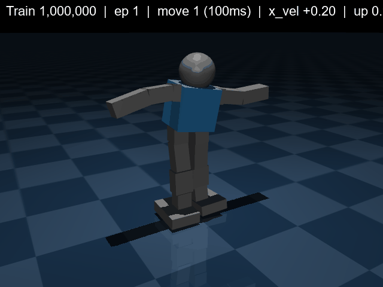

# Alpha Humanoid Walking — SAC

Bipedal locomotion for the **Alpha humanoid robot** (16 DOF, ~1.58 kg) using Soft Actor-Critic in MuJoCo.



## What it does

Trains a policy that walks stably forward with no falls over 1M+ steps. Each policy step = 100ms, directly mappable to real servo commands (position + transition time).

## Key design choices

- **Action space**: normalised joint positions [-1, 1] — `action=0` maps to standing pose
- **Only leg joints controlled** (10 of 16 actuators); arms are locked to neutral so the sim can't exploit them
- **Policy step = 100ms**: 4 action repeats × 5 physics sub-steps
- **Reward shaping**: forward velocity + foot clearance (rear leg) + COG over support foot + yaw/lateral penalties + foot-flat enforcement to avoid toe push-off

## Train

```
python -u walking.py
```

Checkpoints saved every 50k steps to `checkpoints/walking/`.
GIFs auto-generated in `media/<date>_walking/` at each checkpoint.

## Evaluate / export

```
# GIF from a checkpoint
python tools/simu_a_real/make_walking_gif.py \
    --ckpt checkpoints/walking/sac2_checkpoint_1000000.pt \
    --step 1000000 --out_dir media/

# COG-overlay GIF
python tools/simu_a_real/make_walking_com_gif.py \
    --ckpt checkpoints/walking/sac2_checkpoint_1000000.pt \
    --out media/com_step_1000000.gif

# Export to real robot (.aesx + MP4 with servo overlay)
python tools/simu_a_real/export_aesx_mp4.py \
    --ckpt checkpoints/walking/sac2_checkpoint_1050000.pt \
    --n_steps 10 \
    --out robot/simu_a_real/07_cogv3_pie_plano_v2/step_1050000
```

- `--n_steps`: number of policy steps to export (template supports up to 19)
- `--out`: base path — produces `<out>.aesx` and `<out>.mp4`
- MP4 plays at 5 fps (8× slower than real-time), overlays servo values per joint per step
- Step 1 = rest position, Step 2+ = simulation steps
- Template: `robot/simu_a_real/01_pruebas_iniciales/exportado_por_sw_ubtech.aesx`

## Scripts reference

### Core
| Script | Description |
|---|---|
| `walking.py` | SAC training loop (Actor-Critic with automatic entropy tuning) |
| `walking_env.py` | MuJoCo environment: observation, reward shaping, reset, step |

### Evaluation / visualisation
| Script | Description |
|---|---|
| `tools/simu_a_real/make_walking_gif.py` | Lateral-view GIF — called automatically every 50k steps |
| `tools/simu_a_real/make_walking_com_gif.py` | COG-trajectory overlay GIF |
| `tools/simu_a_real/export_keyframes.py` | Exports keyframe positions per checkpoint |

### Real robot export
| Script | Description |
|---|---|
| `tools/simu_a_real/export_aesx_mp4.py` | **Main export**: `.aesx` (UBTech format) + `.mp4` with servo overlay |
| `tools/simu_a_real/export_mp4.py` | MP4 only |
| `tools/simu_a_real/export_servo_csv.py` | Servo values to `.csv` |
| `tools/simu_a_real/export_servo_intervals.py` | Servo values with step timing intervals |

### Tests
| Script | Description |
|---|---|
| `tools/tests/test_joint_mapping.py` | Validates sim↔real joint direction mapping |
| `tools/tests/test_servo_50deg.py` | Single servo ±50° sanity check |
| `tools/tests/test2_lift_legs_90deg.py` | Both legs lift to 90° |
| `tools/tests/test3_mujoco_lift_legs.py` | Same test driven from MuJoCo |

### Utilities
| Script | Description |
|---|---|
| `robot/simu_a_real/scripts/extrae.py` | Decodes `.aesx` binary (frames, durations, servo values) |
| `robot/simu_a_real/scripts/genera.py` | Injects CSV servo values into a `.aesx` template |
| `manual/paso_manual.py` | Manual step definition for hardware testing |

### Experimental training approaches
| Script | Description |
|---|---|
| `train_approaches/4_phases/train_4phases.py` | Curriculum in 4 reward phases |
| `train_approaches/4_phases_v2/train_4phases_v2.py` | Phase curriculum v2 |

## Structure

```
DDPG-SAC-HumanoidWalking/
├── walking.py                  # SAC training loop
├── walking_env.py              # MuJoCo environment + reward shaping
├── robot/
│   ├── configs/
│   │   ├── v1/                 # Robot model v1 (original geometry)
│   │   └── v2/                 # Robot model v2 (corrected knee pivot)
│   └── simu_a_real/            # Sim → real export artefacts (per session)
│       ├── 01_pruebas_iniciales/
│       ├── 02_pruebas_27mar/
│       ├── 03_test_joints/
│       ├── 04_movs_v13_700k/
│       ├── 05_debug_700k_v1/
│       ├── 06_debug_700k_v2/
│       ├── 07_cogv3_pie_plano_v2/
│       ├── referencia/         # Joint mapping docs, servo reference
│       └── scripts/            # extrae.py / genera.py
├── tools/
│   ├── simu_a_real/            # GIF, MP4 and .aesx export scripts
│   └── tests/                  # Hardware and sim validation tests
├── train_approaches/           # Experimental curriculum approaches
├── manual/                     # Manual step definitions for hardware
├── checkpoints/
│   └── walking/                # Saved checkpoints (every 50k steps)
└── media/                      # GIFs/videos per training run
```
